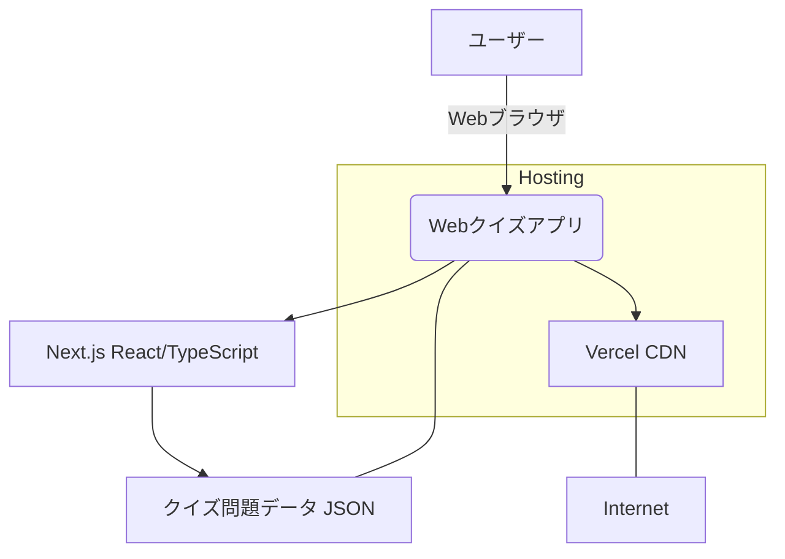

## 概要

- セキュリティに関するWebアプリケーション
- フロントエンドのみ（ユーザー認証やバックエンドサーバーは未使用）
- 参加者はWebブラウザを通じてクイズに挑戦し、最終的なスコアの確認が可能

## 目標

- ユーザー登録不要：URLにアクセスするだけで即座にクイズを開始できる。
- オフライン動作（一部）: デプロイ後は、クイズ問題データがブラウザにロードされるため、限定的ながらネットワークが不安定な環境でも動作可能。
- 高速なレスポンス: 静的サイトとしてデプロイするため、ページの読み込みや画面遷移が高速。
- 学習効果: クイズを通してサイバーセキュリティに関する知識を深められるよう、正誤判定と解説を提供
- 運用コストの最小化: サーバーレスのため、運用コストが極めて低い

## 技術スタック選定

|  | 技術スタック | 詳細 |
| --- | --- | --- |
| フレームワーク | Next.js | モダンなUI開発に最適。SSR/SSGによるパフォーマンス向上、開発体験の良さ、豊富なコミュニティサポート |
| スタイリング | TailwindCSS | モダンなUI開発 |
| 開発言語 | TypeScript | 静的型付けにより、開発時のエラーを削減し、コードの保守性と可読性を向上させる。大規模化・複雑化にも対応しやすい |
| デプロイ | Vercel | Next.jsの開発元が提供するホスティングサービス。Git連携による自動デプロイ、高速なCDN配信、高い信頼性 |
| データ管理 | JSONファイル | クイズ問題データをアプリケーションに直接バンドルするため、バックエンド不要で問題の管理・取得が可能 |
| 状態管理 | React Hooks | useState, useReducer, Context APIなどを活用し、アプリケーションの状態（スコア、現在の問題、タイマーなど）を管理 |

## システム構成図



- ユーザー: PC、スマートフォン、タブレットなどのWebブラウザからアプリにアクセス
- Webクイズアプリ (Next.js/React/TypeScript): クライアントサイドで動作するSPA（Single Page Application）として構築される。
- クイズ問題データ (JSON): アプリケーションのビルド時にバンドルされ、サーバーへの通信なしに問題を読み込む
- Vercel (CDN): アプリケーションのコードと静的アセット（JSONファイル含む）をホスティングし、高速にユーザーに配信

## 主要機能と設計

### クイズ問題データ管理

- データ形式: クイズ問題は、以下のフィールドを持つJSONオブジェクトの配列としてpublic/data/quizzes.jsonのようなパスに格納

```json
// public/data/quizzes.json
[
 {
  "id": "string (一意のID)",
  "question": "string (問題文)",
  "choices": ["string (選択肢1)", "string (選択肢2)", "..."],
  "answer": "string (正解の選択肢)",
  "explanation": "string (解説文)"
 },
 // ... 他の問題
]
```

- データ取得: アプリケーション起動時に、このJSONファイルをフェッチ（またはインポート）し、メモリ上にロードする。

### アプリケーションフロー

- ホーム画面 (/):
    - アプリのランディングページ
    - 各種クイズ（3パターンの予定）の選択ボタン
- クイズ画面 (/quiz):
    - 問題表示: ロードされたJSONデータからランダムに1問を選択して表示
    - 選択肢表示: 選択肢をボタンまたはリストとして表示
    - タイマー表示: （任意）各問題に解答時間制限を設ける場合は、残り時間を表示
    - 正誤判定: ユーザーが選択肢をクリックすると、即座に正解か不正解かを判定し、視覚的にフィードバック
    - スコア加算: 正解の場合、スコアを加算
    - 解説表示: 正誤判定後、短い解説文をポップアップまたは問題の下に表示
    - 次の問題へ: 一定時間経過後、または「次の問題へ」ボタンクリックで次の問題へ遷移。全問終了後、結果画面へ遷移。
- 結果画面 (/result):
    - 総合スコア表示: クイズ全体の正解数と最終スコアを表示。
    - 間違えた問題の解説一覧: 回答したすべての問題とそれに対する解説を一覧で表示
    - 「もう一度挑戦」ボタンなどを配置し、再度クイズを開始できるようにする。

### 状態管理（React Hooksによる実装例）

- quizState:
    - currentQuestionIndex: 現在表示中の問題のインデックス
    - score: 現在のスコア
    - answeredQuestions: 回答済みの問題とその結果（正誤、選択肢など）の配列
    - quizStatus: 'idle' (開始前), 'playing' (クイズ中), 'finished' (終了) などの状態
    - timer: 残り時間（任意）
- useReducerまたはuseStateの組み合わせでこれらの状態を管理し、コンポーネント間で共有する必要がある場合はContext APIを検討する

## 非機能要件

- パフォーマンス:
    - 静的サイト生成(SSG)により、初回ロードを高速化
    - CDN (Vercel) を利用して、ユーザーの地理的な位置に関わらず高速にコンテンツを配信
- アクセシビリティ:
    - キーボード操作やスクリーンリーダーにも配慮したUI/UXを設計
    - サイトUIは以下を参考\
    [Locker.ai 遺失物データセット用 アンケートアプリ](https://lockerai-survey.vercel.app/)
    
- レスポンシブデザイン:
    - PC、タブレット、スマートフォンなど、様々な画面サイズに対応し、快適に操作できるデザインとする。
- 可用性:
    - Vercelのインフラは高可用性設計がされているため、サーバーダウンのリスクは低い。
- セキュリティ:
    - クライアントサイドのみの動作であり、機密情報を扱わないため、一般的なWebセキュリティ対策（XSS対策、CORSなど）はVercelやNext.jsの標準機能で対応可能
    - クイズ問題データの改ざん防止は、ソースコードの公開を前提としないため、基本的には考慮しない（ユーザーがブラウザの開発者ツールで中身を見ることは可能）

## 開発フェーズ

- 環境構築: Next.js + TypeScriptプロジェクトのセットアップ。
- クイズ問題データ作成: quizzes.jsonファイルの作成。
- UIコンポーネント開発:
    - 開始画面、クイズ問題表示コンポーネント、選択肢コンポーネント、結果表示コンポーネントなど。
- ロジック開発:
    - 問題のシャッフル、出題ロジック
    - 正誤判定、スコア計算、タイマー処理
    - 画面遷移ロジック
    - セッション内ランキングのデータ管理（sessionStorage利用など）
- デプロイ:
    - Vercelへのデプロイ設定（Gitリポジトリ連携）。
- テスト:
    - 各機能の単体テスト
    - 結合テスト
    - UI/UXテスト
